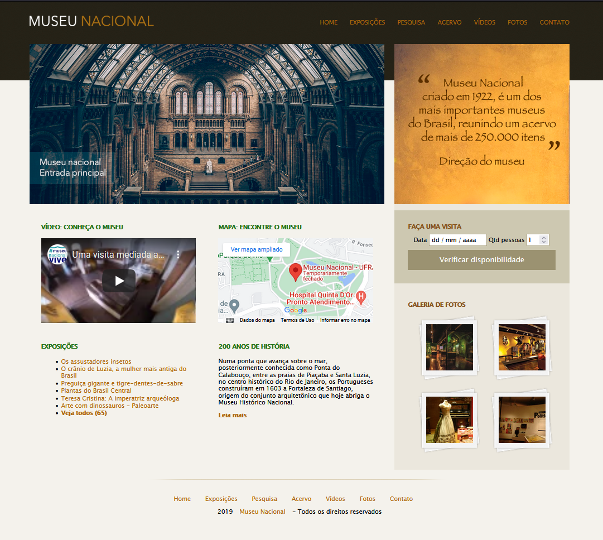

# Museu Nacional

<!---Esses são exemplos. Veja https://shields.io para outras pessoas ou para personalizar este conjunto de escudos. Você pode querer incluir dependências, status do projeto e informações de licença aqui--->

> Projeto front-end do website Museu Nacional desenvolvido durante as aulas de número 97 à 99 do curso "Desenvolvimento Web Completo 2022", pela Udemy, com instrução do [Jamilton Damasceno](https://github.com/jamiltondamasceno).

> Para além do projeto proposto, o código foi refatorado para:
>
> - [x] Substituir elementos flutuantes por flexbox
> - [x] Aplicar a metodologia BEM nas classes CSS

## Ajustes e melhorias

O projeto ainda está em desenvolvimento e as próximas atualizações serão voltadas nas seguintes tarefas:

- [ ] Tornar o website responsivo com Bootstrap 4
- [ ] Aplicar validação de formulário com JavaScript
- [ ] Aplicar menu dropdown quando o site for visualizado em dispositivos móveis

## 📫 Contribuindo para o projeto Museu Nacional

Para contribuir com o projeto Museu Nacional, comigo e com demais desenvolvedores iniciantes, peço que utilizem as [Issues](https://github.com/artaugusto/Museu-Nacional/issues), criando um debate sobre o código e possíveis melhorias.

## 📝 Licença

Esse projeto está sob licença. Veja o arquivo [LICENÇA](LICENSE) para mais detalhes.

[⬆ Voltar ao topo](#Museu-Nacional)
